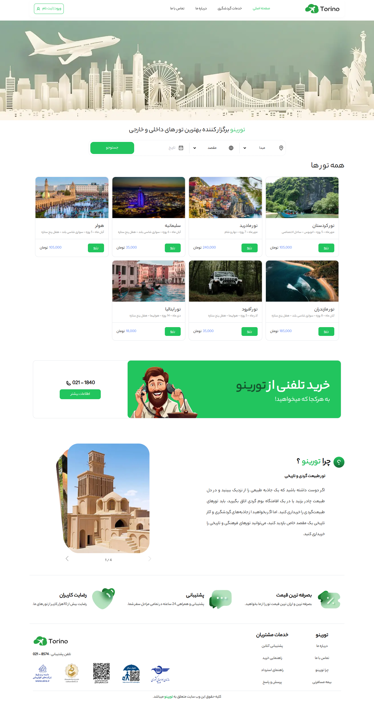
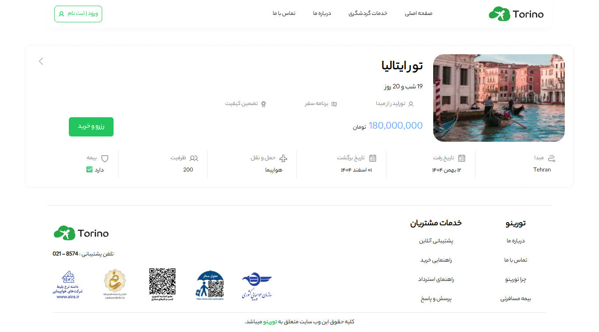
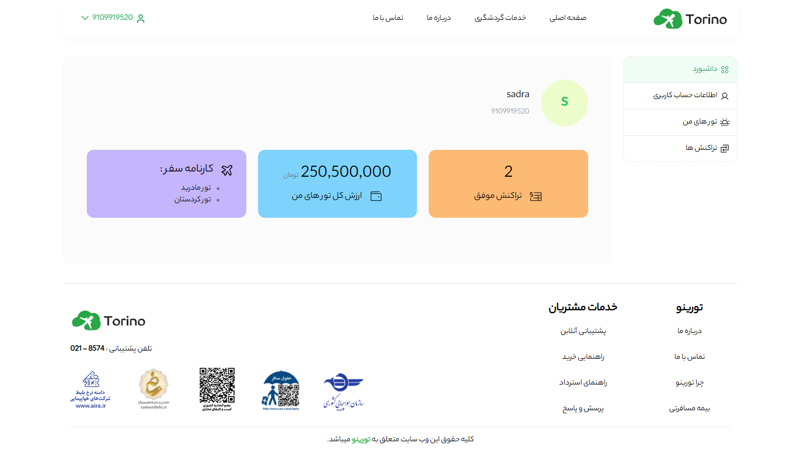

# Tourino ✈️
### Tour booking platform
**Tourino** is a modern web application for discovering , browsing and booking domestic and international tours. 
It offers the best travel experiences with seamless online booking , an intuitive user dashboard and responsive design.

[Live Demo](https://tourino-v1.vercel.app)

## 📸 Screenshots

| Homepage | Tour Details | Dashboard |
|----------|-------------|-----------|
|  | | |

<br/>

## ✨ Key Features
- 🔎 **Tour Search & Filtering** \
    Search by origin , destination and date.

- 🛒 **Seamless Booking** \
    One-click reservation with basket management.

- 👤 **Phone‑based OTP Auth** \
    JWT access & refresh tokens stored in cookies.

- 📊 **User Dashboard** \
    Overview of purchased tours , total spending and transaction history.

- 📱 **Fully Responsive** \
    Mobile‑first design using Tailwind CSS. Optimised for all screen sizes from smartphones to desktops.

- ⚡ **Smart Caching** \
    TanStack Query for efficient server state and background updates.

- 🎨 **Professional UI** \
    Built with Shadcn/ui components, Phosphor icons, and subtle animations for a premium user experience.

<br/>


## 🧱 Tech Stack
| Category | Technology |
|----------|------------|
| Framework | [Next.js](https://nextjs.org) 14 ( App Router ) |
| Styling | [TailwindCSS](https://tailwindcss.com/) ( v4.1 ) & [Shadcn/ui](https://ui.shadcn.com/) |
| Data Fetching | [TanStack Query](https://tanstack.com/query)|
| HTTP Client | [Axios](https://axios-http.com/) | 
| Forms | Formik & Yup |
| Date Picker | [react‑multi‑date‑picker](https://shahabyazdi.github.io/react-multi-date-picker/) |
| Notifications | [react‑hot‑toast](https://react-hot-toast.com/) |
| Icons | [Phosphor Icons](https://phosphoricons.com/) |


<br/>


## 🧠 Architecture Overview
```
tourino-app/
├── public/
├── src/
│ ├── app/ 
│ │ ├── (protected)/
│ | │ ├── profile/
│ | │ | ├─── account/
│ | │ | | ├──── AccountCard.js
│ | │ | | ├──── layout.js
│ | │ | | ├──── page.js
│ | │ | ├─── basket/
│ | │ | | ├──── basket.js
│ | │ | | ├──── layout.js
│ | │ | | ├──── page.js
│ | │ | ├─── dashboard/
│ | │ | | ├──── layout.js
│ | │ | | ├──── page.js
│ | │ | ├─── my-tour/
│ | │ | | ├──── MyTours.js
│ | │ | | ├──── layout.js
│ | │ | | ├──── page.js
│ | │ | ├─── transactions/
│ | │ | | ├──── transactions.js
│ | │ | | ├──── layout.js
│ | │ | | ├──── page.js
│ | │ | ├─── layout.js
│ | │ | ├─── page.js
│ | │ ├── layout.js
│ │ ├── fonts/
│ │ ├── tour/
│ | │ ├── [tourId]/
│ | │ | ├─── HighlightedTour.js
│ | │ | ├─── loading.js
│ | │ | ├─── page.js
│ | │ | ├─── ReserveLink.js
│ │ ├── error.js
│ │ ├── layout.js
│ │ ├── not-found.js
│ │ ├── page.js
│ │ ├── favicon.ico
│ │ ├── globals.css
│ │ 
│ ├── components/
│ │ ├── icons/
│ │ ├── layout/
│ │ ├── ui/
│ │ ├── ...
│ ├── helper/
│ │ ├── helper.js
│ ├── hooks/
│ │ ├── useHasToken.js
│ │ ├── useRedirecting.js
│ │ ├── useTimer.js
│ │ ├── useUser.js
│ ├── lib/
│ │ ├── api.js
│ │ ├── utils.js (for shadcn-ui)
│ ├── provider/
│ │ ├── TanstackQueryProvider.js
│ ├── services/
│ │ ├── mutations.js
│ │ ├── queries.js
│ ├── utils/
│ │ ├── cookie.js
│ │ ├── UserAccountSchema.js
│ │ ├── UserSchema.js
│ └── middleware.js
├── tailwind.config.js
├── .env
├── components.json
├── jsconfig.json
├── next.config.js
└── package.json
└── package-lock.json
└── postcss.config.mjs
└── tailwind.config.js
```
<br/>

## 🚀 Getting Started

### Prerequisites

- Node.js 18+
- npm or yarn
- the [Tourino API](https://github.com/sadranafe/tourino-api) running locally or deployed

### 🖥️ Running Locally
**1. Clone Repo**
```bash
git clone https://github.com/sadranafe/tourino.git
cd tourino
npm install
```

**2.Set up the API**
```bash
git clone https://github.com/sadranafe/tourino-api.git
cd tourino-api
npm install
npm start
```
**3. Create your local environment file** \
Create a `.env.local`file in the project root :
```
NEXT_PUBLIC_BASE_URL=http://localhost:6500
```

>⚠️ `.env.local` is gitignored and should **never** be committed.

**4. Start the development server**
```bash
npm run dev
```
open [localhost:3000](http://localhost:3000) in your browser.

<br/>

### ☁️ Deploying to Production
Tourino is deployed on **Vercel** (frontend) and **Railway** (API)

**1. Deploy the API on Railway**
- Fork the [API repo](https://github.com/sadranafe/tourino-api)
- connect it to [Railway](https://railway.app)
- add these environment Variables in Railway dashboard :
```env
PORT=6500
JWT_SECTRET=your_secret_key
```

**2. Deploy the frontend on vercel**
- Import this repo on [Vercel](https://vercel.com)
- Add this environment variable in the Vercel dashboard under **Settings → Environment Variables**:
```env
NEXT_PUBLIC_BASE_URL=https://your-api.up.railway.app
```

- Deploy and you're live ! 🎉

<br/>

## ⚡ Performance Optimizations
Tourino is optimized for high performance and smooth user experience.

- Incremental Rendering with Server components \
    for data-heavy pages ( reduced client bundle )

- Image optimization \
    `next/image` for responsive delivery, automatic resizing, and web‑friendly compression.

- Client-side Caching via React Query \
    for client-side caching and background updates

- Optimized Rendering Strategy
    - SSR for SEO‑critical and data‑intensive routes
    - CSR for interactive dashboard experiences
    - SSG for rarely changing content


<br/>

## 🔐 Authentication Flow
```
1. User enters phone number
2. POST /auth/send-otp  →  OTP sent
3. POST /auth/check-otp  →  Tokens returned
4. Tokens stored in cookies ( accessToken + refreshToken )
5. Middleware protects /profile/* routes
6. Axios interceptors auto-refresh on 401
```

<br/>


## 🤝 Contributing
Contributions are welcome! Feel free to open an issue or submit a pull request.
> [!Tip]
> 📧 contact : [sadranafe7@gmail.com](mailto:sadranafe7@gmail.com)


<br/>


## 🙏 Acknowledgements
- special thanks to **Milad azami** for mentorship and guidance throughout this project.  
- Gratitude also goes to the **Boto Start Bootcamp** for the structured learning environment

built with ❤️ by [sadra nafe](https://github.com/sadranafe)
